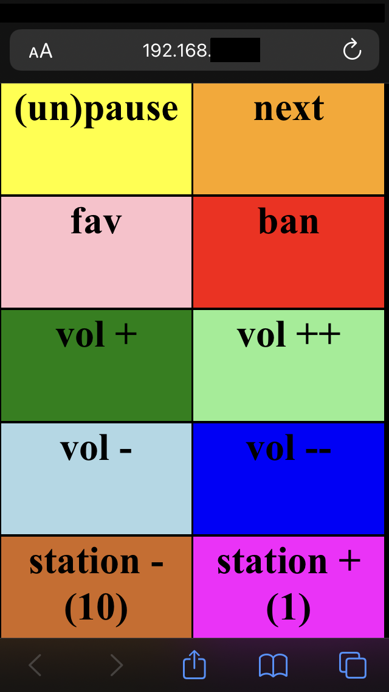

# pianobar-remote-control

No-frills, web-based remote controll for [pianobar](https://github.com/PromyLOPh/pianobar).



## Motivation

To be able to control (skip/volume/select-station) from web/phone while away from the machine playing music.  Or maybe `pianobar` is running on a headless machine like a `raspberry pi`.

## Requirements
To run:
* [pianobar](https://github.com/PromyLOPh/pianobar) already installed, as this will call `pianobar` under the hood.

To build from source:
* [GoLang](https://go.dev/)


## Usage
Run `pianobar-rc` and it will play music via `pianobar`, and then you can visit `http://127.0.0.1:7890` or the device's IP at `:7890` to open the remote control.

```
$ ./pianobar-rc -h

Usage of ./pianobar-rc:
  -hardban
    	If set, the 'ban' button does a perm ban instead of 1 month. (issues ban instead of tired command).
  -http string
    	Listen address for serving web remote control. (default "0.0.0.0:7890")
  -m uint
    	Max number of stations/how high next-channel goes before wraps back to 0. (default 10)
  -p string
    	Password
  -paused
    	Start paused. Useful if auto-starting this program on boot but don't want to play until first use.
  -s uint
    	Default station number on start.
  -u string
    	Username
```

Minimum with defaults:
```
$ ./pianobar-rc -u user@example.com -p Password123

2022/01/21 19:45:51 Listening on http://0.0.0.0:7890, playing station: 0 of 10. Hard-ban: false
```

But you'll want to at least specify the max number of channels you can cycle through and which to start at:

```
./pianobar-rc -u user@example.com -p Password123 -s 12 -m 40

2022/01/21 19:48:38 Listening on http://0.0.0.0:7890, playing station: 12 of 40. Hard-ban: false
```

## Building
```
go build -o pianobar-rc main.go
```

## Developing

```
go fmt ./... && go vet ./... && go build -o pianobar-rc main.go
```

## Releases

### 0.1
Initial release!

### Cross Compiled Releases
```
RELEASE=0.1
osArray=("linux" "darwin")
archArray=("386" "amd64" "arm" "arm64")

for i in ${!osArray[@]}; do
  for j in ${!archArray[@]}; do

    GOOS=${osArray[$i]} GOARCH=${archArray[$j]} go build -o pianobar-rc-${RELEASE}-${osArray[$i]}-${archArray[$j]} main.go

  done
done

```
